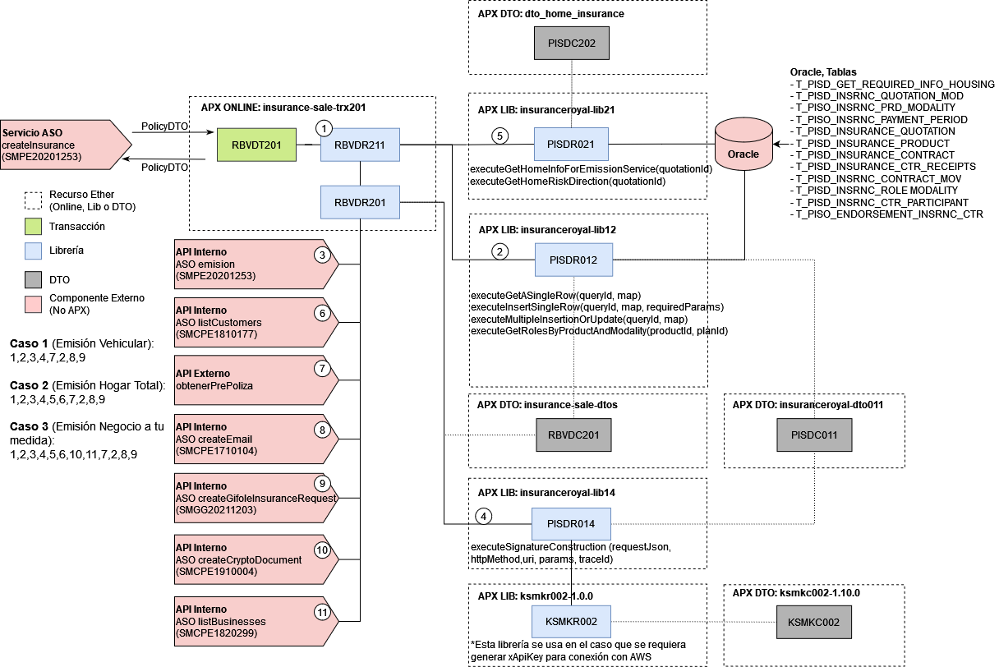

# 
# Recurso APX Online insurance-sale-trx201

> El objetivo de este documento es proveer informacion relacionada de las transacciones online dentro de este recurso que ha sido implementado sobre la Arquitectura APX y desplegado a traves de la Consola Ether.

## 1. Transacciones:
> En este apartado se detallan todas las transacciones implementadas.

### 1.1. Transaccion RBVDT201
- Descripcion: Genera un alta de poliza para el servicio createInsurance de insurances
- Tipo de Origen: Servicio de Negocio
- API de Negocio: [insurances](https://catalogs.platform.bbva.com/apicatalog/business/apis/apis-insurances-insurances/versions/global-1.20.0/resources/insurancesapiinsurancesv1/)
- SMC del Servicio ASO: [Documento](https://docs.google.com/spreadsheets/d/12EImg0zkqGqGWVxjgbtQHF3zVWGyuZPVTf4b7127h6s/edit#gid=481680258)
- Usuario Transaccional: ZG13001 y ZG13003
- Version: 01-PE
- Respuestas:
    - Código de respuesta: Http Code: 200, Severity: OK
    - Código de Respuesta: Http Code: 400, Severity: ENR

## 2. DTOs:

> En este apartado se detallan todas las clases DTOs utilizadas en este recurso.
- **RBVDC201**:
    - dao:
        - **SimltInsuredHousingDAO**: Entidad para DAO para obtener información de hogar.
- **PISDC011**:
    - aso:
        - customerList:
            - **CustomerListASO**: Entidad CustomerListASO
        - bo:
            - customer:
                - **AddPersonBO**: Entidad RegisterAdditionalVehBO
                - **CustomerBO**: Entidad CustomerBO
                - **DataPersona**: Entidad DataPersona
                - **Persona**: Entidad Persona
    - utils:
        - **PISDConstants**: Entidad Constantes
        - **PISDErrors**: Entidad Errores
        - **PISDProperties**: Entidad Propiedades
- **RBVDC201**:
    - aso:
        - emision:
            - **PolicyASO**: Entidad poliza
            - **DataASO**: Entidad data
            - **ProductPlanASO**: Entidad plan de producto
            - **PaymentMethodASO**: Entidad método de pago
            - **ValidityPeriodASO**: Entidad periodo de validez
            - **TotalAmountASO**: Entidad monto total
            - **InsuredAmountASO**: Entidad monto asegurado
            - **InstallmentPlanASO**: Entidad plan de pago
            - **FirstInstallmentASO**: Entidad primer pago
            - **ParticipantASO**: Entidad participante
            - **BusinessAgentASO**: Entidad gestor
            - **PromoterASO**: Entidad presentador
            - **InsuranceCompanyASO**: Entidad compañia aseguradora
            - **StatusASO**: Entidad estado
            - **BankASO**: Entidad banco
    - bo:
        - emision:
            - **EmisionBO**: Entidad emision
            - **PayloadEmisionBO**: Entidad payload
            - **ContactoInspeccionBO**: Entidad contacto inspección
            - **DatoParticularBO**: Entidad dato particular
            - **CuotaFinancimientoBO**: Entidad cuota financiamiento
            - **EndosatarioBO**: Entidad endosatario
    - policy:
        - **PolicyDTO**: Entidad poliza para APX
        - **PolicyProductPlan**: Entidad plan de producto para APX
        - **PolicyPaymentMethodDTO**: Entidad metodo de pago para APX
        - **TotalAmountDTO**: Entidad cantidad total para APX
        - **InsuredAmountDTO**: Entidad cantidad asegurada para APX
        - **InsuranceCompanyDTO**: Entidad compañia aseguradora para APX
        - **RelatedContractDTO**: Entidad contratos relacionados
        - **PolicyInstallmentPlanDTO**: Entidad plan de pago para APX
        - **FirstInstallmentDTO**: Entidad primer pago para APX
        - **ParticipantDTO**: Entidad participante para APX
        - **BusinessAgentDTO**: Entidad gestor para APX
        - **PromoterDTO**: Entidad presentador para APX
    - commons:
        - **HolderDTO**: Entidad titular
        - **PaymentAmountDTO**: Entidad cantidad de pago
        - **IdentityDocumentDTO**: Entidad documento de identidad
        - **ValidityPeriodDTO**: Entidad periodo de validez
        - **PolicyInspectionDTO**: Entidad inspección
        - **ExchangeRateDTO**: Entidad tipo de cambio
        - **QuotationStatusDTO**: Entidad estado de cotizacion
        - **BankDTO**: Entidad banco
        - **LinkDTO**: Entidad link
        - **ContactDetailDTO**: Entidad detalle de contacto

## 3. Librerias:

### 3.1. Librerias Internas
> En este apartado se detallan todas las librerias internas creadas para implementar la logica de negocio de las transacciones.

#### 3.1.1. Libreria RBVDR201
> Orientada a consumir el servicio createInsurance del API insurances,
> el servicio createEmail del API notifications-gateway y el servicio de emisión de poliza de Rimac.

- **Método executePrePolicyEmissionASO(DataASO requestBody)**: Método que consume el servicio ASO createInsurance, para recuperar el alta del seguro generada por Host.
    - Avisos a retornar: RBVD00000136
- **Método executePrePolicyEmissionService(EmisionBO requestBody, String quotationId, String traceId)**: Método para generar la poliza por el lado de Rimac
    - Avisos a retornar: RBVD00000137 y RBVD00000138.
- **Método executeCreateEmail(CreateEmailASO createEmailASO)**: Método para realizar una petición al servicio createEmail del API notifications-gateway
    - Avisos a retornar: -
- **Método executeGetCustomerInformation(String customerId)**: Método para obtener información del cliente a través del servicio ASO listCustomers
    - Avisos a retornar: PISD00120034

#### 3.1.2. Libreria RBVDR211
> Orientada a realizar la lógica de negocio de la transacción RBVDT201.

- **Método executeBusinessLogicEmissionPrePolicy(PolicyDTO requestBody)**: Método que ejecuta toda la lógica de negocio
    - Avisos a retornar: RBVD00000129, RBVD00000121, RBVD00000122, RBVD00000123 y RBVD00000124.

### 3.2. Librerias Externas
> En este apartado se detallan las librebrias externas que hace uso esta aplicacion para acceder a fuentes de terceros.

- **Libreria PISDR012**: [Ver documentaction](https://globaldevtools.bbva.com/bitbucket/projects/PE_PISD_APP-ID-26197_DSG/repos/insuranceroyal-lib12/browse/doc?at=refs%2Fheads%2Frelease%2F0.23)
    - Metodos reutilizados: executeGetRequiredFieldsForEmissionService(), executeGetPaymentPeriod(), executeSaveContract(), executeSaveContractEndoserment(), executeSaveReceipts(), executeSaveContractMove(), 
      executeGetRolesByProductAndModality(), executeSaveParticipants().

- **Libreria PISDR021**: [Ver documentaction](https://globaldevtools.bbva.com/bitbucket/projects/PE_PISD_APP-ID-26197_DSG/repos/insuranceroyal-lib21/browse/doc?at=release/0.1)
    - Metodos reutilizados: executeGetHomeInfoForEmissionService().

- **Libreria PISDR014**: [Ver documentaction](https://globaldevtools.bbva.com/bitbucket/projects/PE_PISD_APP-ID-26197_DSG/repos/insuranceroyal-lib14/browse/doc/PISD-insuranceroyal-lib14.md?at=refs%2Fheads%2Frelease%2F0.10)
    -  Metodos reutilizados: executeSignatureConstruction().

## 4. Mensajes de Error y Avisos:
> En este apartado se detallan los distintos mensajes de error que retornan las librerias de acuerdo a los casos y logica de negocio implementada.

- **Advise RBVD00000121**: NO SE INSERTÓ DATA EN LA TABLA CONTRACT
- **Advise RBVD00000122**: NO SE INSERTÓ DATA EN LA TABLA CTR RECEIPTS
- **Advise RBVD00000123**: NO SE INSERTÓ DATA EN LA TABLA CONTRACT MOV
- **Advise RBVD00000124**: NO SE INSERTÓ DATA EN LA TABLA CTR PARTICIPANT
- **Advise RBVD00120008**: NO SE INSERTÓ DATA EN LA TABLA ENDORSEMENT
- **Advise RBVD00000129**: LA COTIZACIÓN ENVIADA NO EXISTE EN LA BASE DE DATOS
- **Advise RBVD00000136**: SE ENVIARON DATOS INVÁLIDOS AL SERVICIO CREATEINSURANCE
- **Advise RBVD00000137**: ERROR AL VALIDAR DATOS EN EMISION RIMAC
- **Advise RBVD00000138**: COTIZACION INACTIVA O INEXISTENTE - EMISION RIMAC
- **Advise PISD00120033**: ERROR CONNECTION VALIDATE CUSTOMER SERVICE

## 5. Diseño de componentes:

## 6. Versiones del Componente:
> En este apartado se detalla un historial de cambios o *changelog* por cada version implementada del recurso.

- **Versión 0.4.10**: Se agrega una validación para determinar si se genera una alta diferida o no.
- **Versión 0.4.11**: Enviando y guardando código de usuario como agente y promotor para canales auto-asistidos.
- **Versión 0.4.12**: Se añade un dato particular al request del servicio de emisión de Rimac.
- **Versión 0.5.1**: Se realiza el alta de un seguro con endoso de cesión de derechos.
- **Versión 0.5.3**: Esta versión permite manejar una bifurcación a la hora de consumir servicios de Rimac, lo que permitirá manejar uri's diferentes según el tipo de producto especificado. Se agregaron adecuaciones para producto HOGAR TOTAL.