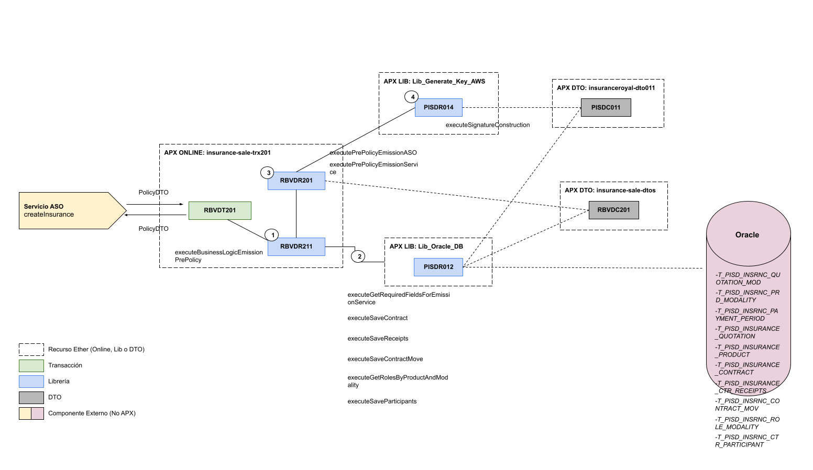

# 
# Recurso APX Online insurance-sale-trx201

> El objetivo de este documento es proveer información relacionada del API "insurances" que utiliza este proyecto y que ha sido implementado en APX y desplegado en la consola de la plataforma.

### 1. API

> Datos del API de Catalogo implementado en el runtime de APX Online.

- API a implementar: [insurances](https://catalogs.platform.bbva.com/apicatalog/business/apis/apis-insurances-insurances/versions/global-1.20.0/resources/insurancesapiinsurancesv1/)
- SN del servicio: *(SNPE20200140)*

### 2. Servicio:

> En este apartado se detallan los endpoints implementados del API insurances.

- createInsurance
    - SMC del Servicio: [Documento](https://docs.google.com/spreadsheets/d/12EImg0zkqGqGWVxjgbtQHF3zVWGyuZPVTf4b7127h6s/edit#gid=481680258)
    - Método HTTP: POST
    - Versión: 1.23.0
    - Endpoint: /insurances/v1/insurances
    - TX: [RBVDT201](#RBVDT201)

### 3. DTOs:

> En este apartado se detallan todas las clases DTOs utilizadas en este recurso.

- **RBVDC201**:
    - aso:
        - emision:
            - **PolicyASO**: Entidad poliza
            - **DataASO**: Entidad data
            - **ProductPlanASO**: Entidad plan de producto
            - **PaymentMethodASO**: Entidad método de pago
            - **ValidityPeriodASO**: Entidad periodo de validez
            - **TotalAmountASO**: Entidad monto total
            - **InsuredAmountASO**: Entidad monto asegurado
            - **InstallmentPlanASO**: Entidad plan de pago
            - **FirstInstallmentASO**: Entidad primer pago
            - **ParticipantASO**: Entidad participante
            - **BusinessAgentASO**: Entidad gestor
            - **PromoterASO**: Entidad presentador
            - **InsuranceCompanyASO**: Entidad compañia aseguradora
            - **StatusASO**: Entidad estado
            - **BankASO**: Entidad banco
    - bo:
        - emision:
            - **EmisionBO**: Entidad emision
            - **PayloadEmisionBO**: Entidad payload
            - **ContactoInspeccionBO**: Entidad contacto inspección
            - **DatoParticularBO**: Entidad dato particular
            - **CuotaFinancimientoBO**: Entidad cuota financiamiento
    - policy:
        - **PolicyDTO**: Entidad poliza para APX
        - **PolicyProductPlan**: Entidad plan de producto para APX
        - **PolicyPaymentMethodDTO**: Entidad metodo de pago para APX
        - **TotalAmountDTO**: Entidad cantidad total para APX
        - **InsuredAmountDTO**: Entidad cantidad asegurada para APX
        - **InsuranceCompanyDTO**: Entidad compañia aseguradora para APX
        - **RelatedContractDTO**: Entidad contratos relacionados
        - **PolicyInstallmentPlanDTO**: Entidad plan de pago para APX
        - **FirstInstallmentDTO**: Entidad primer pago para APX
        - **ParticipantDTO**: Entidad participante para APX
        - **BusinessAgentDTO**: Entidad gestor para APX
        - **PromoterDTO**: Entidad presentador para APX
    - commons:
        - **HolderDTO**: Entidad titular
        - **PaymentAmountDTO**: Entidad cantidad de pago
        - **IdentityDocumentDTO**: Entidad documento de identidad
        - **ValidityPeriodDTO**: Entidad periodo de validez
        - **PolicyInspectionDTO**: Entidad inspección
        - **ExchangeRateDTO**: Entidad tipo de cambio
        - **QuotationStatusDTO**: Entidad estado de cotizacion
        - **BankDTO**: Entidad banco
        - **LinkDTO**: Entidad link
        - **ContactDetailDTO**: Entidad detalle de contacto

### 4. Transacciones APX:
> En este apartado se detallan todas las transacciones creadas para soportar las operaciones del servicio implementado.
- Usuario transaccional: ZG13003 y ZG13001
- **TX - RBVDT201**: Genera un alta de poliza para el servicio createInsurance de insurances
    - Código de respuesta: Http Code: 200, Severity: OK
    - Código de Respuesta: Http Code: 400, Severity: ENR

### 5. Librerías internas:
> En este apartado se detallan las librerías internas creadas para implementar la lógica de negocio del servicio.

- **RBVDR201**: [Ver documentación](RBVD_APX_Library_RBVDR201.md)
- **RBVDR211**: [Ver documentación](RBVD_APX_Library_RBVDR211.md)

### 6. Librerías externas:
> En este apartado se detallan las librerías externas que hace uso esta aplicación.

- **PISDR012**: [Ver documentación](https://globaldevtools.bbva.com/bitbucket/projects/PE_PISD_APP-ID-26197_DSG/repos/insuranceroyal-lib12/browse/doc/PISD_APX_Library_PISDR012.md?at=refs%2Fheads%2Ffeature%2Fxp61540)
    - Métodos reutilizados: executeGetRequiredFieldsForEmissionService(String policyQuotaInternalId), executeSaveContract(Map<String, Object> arguments), executeSaveReceipts(Map<String, Object>[] firstReceiptMap),
      executeSaveContractMove(Map<String, Object> arguments), executeGetRolesByProductAndModality(BigDecimal productId, String modalityType), executeSaveParticipants(Map<String, Object>[] participantsMap)
- **PISDR014**: [Ver documentación](https://globaldevtools.bbva.com/bitbucket/projects/PE_PISD_APP-ID-26197_DSG/repos/insuranceroyal-lib14/browse/doc/PISD_APX_Library_PISDR014.md?at=refs%2Fheads%2Ffeature%2Fxp61540)
    - Métodos reutilizados: executeSignatureConstruction(String payload, String httpMethod, String uri, String queryParams, String traceId)

### 7. Mensajes de Error y Avisos:
> En este apartado se detallan los distintos mensajes de error que retornan las librerías de acuerdo a los casos y lógica de negocio implementada ...

- **Advise RBVD00000121**: NO SE INSERTÓ DATA EN LA TABLA CONTRACT
- **Advise RBVD00000122**: NO SE INSERTÓ DATA EN LA TABLA CTR RECEIPTS
- **Advise RBVD00000123**: NO SE INSERTÓ DATA EN LA TABLA CONTRACT MOV
- **Advise RBVD00000124**: NO SE INSERTÓ DATA EN LA TABLA CTR PARTICIPANT
- **Advise RBVD00000129**: LA COTIZACIÓN ENVIADA NO EXISTE EN LA BASE DE DATOS
- **Advise RBVD00000136**: SE ENVIARON DATOS INVÁLIDOS AL SERVICIO CREATEINSURANCE
- **Advise RBVD00000137**: ERROR AL VALIDAR DATOS EN EMISION RIMAC
- **Advise RBVD00000138**: COTIZACION INACTIVA O INEXISTENTE - EMISION RIMAC

### 8. Diseño de componentes:
# 